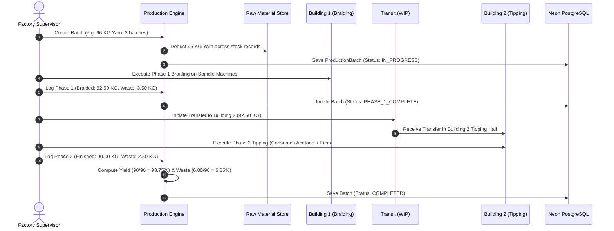
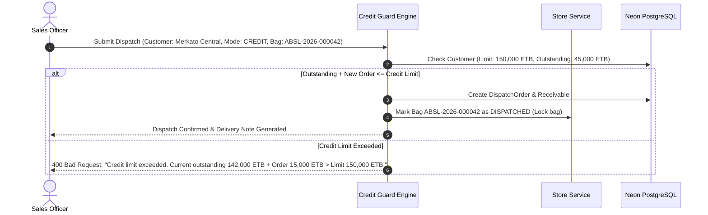

# Ali Bori Shoe Lace Factory ERP — Complete System & Feature Documentation

> **Comprehensive record of all architectures, features, database models, business logic engines, and operational workflows implemented to date.**

---

## Table of Contents

1. [Executive Summary & Transformation](#1-executive-summary--transformation)
2. [Full-Stack Architecture & Tech Stack](#2-full-stack-architecture--tech-stack)
3. [Database Design & Excel Normalization (28 Relational Models)](#3-database-design--excel-normalization-28-relational-models)
4. [Complete Feature Breakdown by Functional Domain](#4-complete-feature-breakdown-by-functional-domain)
   - 4.1. Executive Analytics & Dashboard
   - 4.2. Raw Materials & Multi-Warehouse Inventory
   - 4.3. Stock Requisitions & Approval System
   - 4.4. Two-Phase Manufacturing & Yield/Waste Engine
   - 4.5. Inter-Building WIP Transfers
   - 4.6. Finished Goods Storage & Barcode System
   - 4.7. Customer Relationship & Credit Guard
   - 4.8. Sales Dispatch & Single-Dispatch Lock
   - 4.9. Receivables & Multi-Channel Payment Collection
   - 4.10. Machine Fleet & Preventive Maintenance
   - 4.11. Spare Parts Catalog & Reorder Tracking
   - 4.12. Factory Utility Equipment & Operating Expenses
   - 4.13. Workforce Directory & Skill Allocations
   - 4.14. Daily Attendance & Overtime Tracker
   - 4.15. Configurable Multi-Mode Payroll Engine
   - 4.16. Anti-Fatigue Notification System
   - 4.17. Factory Documents & Compliance Registry
   - 4.18. Excel Migration & Ingestion Engine
   - 4.19. Factory Settings & Dual-Theme System
5. [End-to-End Operational Workflows (Step-by-Step Journeys)](#5-end-to-end-operational-workflows-step-by-step-journeys)
   - Workflow A: Raw Material Ingestion to Production Issue
   - Workflow B: Two-Phase Manufacturing Lifecycle & Yield Calculation
   - Workflow C: Finished Goods Packing & Store Placement
   - Workflow D: Sales Order, Credit Verification & Dispatch
   - Workflow E: Debt Recovery & Partial/Full Payment Collection
   - Workflow F: Machine Breakdown, Critical Alert & Spare Consumption
   - Workflow G: Daily Attendance & Automated Monthly Payroll Run
6. [Complete RESTful API Directory](#6-complete-restful-api-directory)
7. [Testing & Quality Verification](#7-testing--quality-verification)

---

## 1. Executive Summary & Transformation

The **Ali Bori Shoe Lace Factory ERP** is a production-grade full-stack Enterprise Resource Planning platform developed specifically for Ali Bori Shoe Lace Factory, one of Ethiopia's premier shoelace manufacturers. 

Prior to this project, factory management tracked operations across **12 disjointed sheets** in an operational Excel workbook (`ali bori NEW shoe lace.xlsx`):
- `MACHINES` (365 machine units across Building 1 and Building 2)
- `MACHINE PARTS` (Machine types and component specifications)
- `RAW MATERIALS` (Polyester yarn in multiple colors across storage locations)
- `PRODUCTES` (Shoelace variants, serial codes, thickness, colors)
- `shop count` (Daily factory production counts and ledger balances)
- `SPARES` (Spare parts inventory, shelf coordinates, reorder thresholds)
- `LABORERS` (27 factory workers, room assignments, salaries)
- `UTILITIES` (Auxiliary equipment: drills, grinders, mizan scales)
- `ADDITIONAL PAYMENTS` (Saturday shift rates and weekly allowances)
- `utilities payment` (Factory utility and maintenance expenses)
- `files&documents` (Document room and shelf index)
- `attendance` (Manual daily presence records)

### The Transformation
The manual spreadsheets were re-architected into a **relational, cloud-hosted PostgreSQL database on Neon Cloud** (isolated in the `alibori` schema), backed by **Django REST Framework** business engines and an **industrial React 19 + TypeScript frontend** designed with dual artisanal dark & light themes.

---

## 2. Full-Stack Architecture & Tech Stack

```
+-----------------------------------------------------------------------------------+
|                            FRONTEND (Vite + React 19 + TypeScript)                 |
|  - 19 Operational Views (Dashboard, Production, Store, Dispatch, Payroll, etc.)   |
|  - TanStack React Query (5-min client cache + optimistic updates)                 |
|  - Tailwind CSS + Lucide Icons + Canvas Confetti                                  |
|  - Dual Theme System: Industrial Dark (#140A05) & Artisanal Light (#F6F3ED)       |
+-----------------------------------------+-----------------------------------------+
                                          | Axios HTTP Client (/api/v1/)
                                          v
+-----------------------------------------------------------------------------------+
|                        BACKEND (Python 3.11+ / Django 5.1 + DRF)                  |
|  - RESTful Domain ViewSets with Filtering, Search, and Pagination                 |
|  - Two-Phase Yield & Waste Mathematical Engine                                    |
|  - Customer Credit Guard & Single-Dispatch Lock                                   |
|  - Multi-Mode Configurable Payroll Calculator                                     |
|  - Anti-Fatigue NotificationService with Role-Based Routing                       |
|  - Idempotent Excel Data Normalization Engine (OpenPyXL)                          |
+-----------------------------------------+-----------------------------------------+
                                          | psycopg3 / SQLAlchemy
                                          v
+-----------------------------------------------------------------------------------+
|                      DATABASE (Cloud PostgreSQL on Neon AWS us-east-2)            |
|  - Dedicated Schema: 'alibori'                                                    |
|  - 28 Normalized Relational Tables with Foreign Keys & Unique Constraints          |
|  - DB-Level Check Constraints (Weight positive, single dispatch, attendance uniqueness) |
+-----------------------------------------------------------------------------------+
```

### Technology Matrix
- **Backend Framework**: Django 5.1 & Django REST Framework (DRF)
- **Programming Language**: Python 3.11+
- **Database Engine**: PostgreSQL 16 (Neon Serverless Cloud)
- **Frontend Stack**: React 19, TypeScript, Vite 8
- **State Management & Caching**: TanStack React Query v5
- **Styling**: Tailwind CSS with custom industrial color palette:
  - *Industrial Dark*: Background `#140A05`, Cards `#1E130D`, Rust Accent `#8B461E`, Amber Gold `#C87A38`, Paper White `#FAF8F5`.
  - *Artisanal Light*: Background `#F6F3ED`, Cards `#FFFFFF`, Borders `#E4DBCB`, Rust Accent `#8B461E`, Amber Gold `#B6631F`, Espresso Text `#18100A`.
- **Excel Processor**: OpenPyXL for workbook normalization

---

## 3. Database Design & Excel Normalization (28 Relational Models)

The 12 original sheets were normalized into 28 relational database models across 11 modular Django applications:

| Application | Models | Excel Source Sheet | Core Responsibility |
| :--- | :--- | :--- | :--- |
| `apps.catalog` | `Color`, `Thickness`, `Product`, `ProductVariant`, `ProductStock` | `PRODUCTES`, `shop count` | Standardizes colors, thicknesses, shoe lace SKUs, and stock ledgers. |
| `apps.assets` | `MachineType`, `Machine`, `SparePart`, `MachineTypeSparePartCompatibility`, `SparePartInventoryTransaction`, `UtilityEquipment`, `UtilityMaintenanceExpense` | `MACHINES`, `MACHINE PARTS`, `SPARES`, `UTILITIES`, `utilities payment` | Fleet of 365 machines, maintenance intervals, spare parts with shelf coordinates, and utility equipment. |
| `apps.inventory` | `StorageLocation`, `RawMaterialType`, `RawMaterialVariant`, `RawMaterialStock`, `RawMaterialInventoryTransaction`, `StockRequest`, `StockRequestItem` | `RAW MATERIALS` | Multi-location yarn inventory (ST V, ST N, Racks A/B/C/D), audit transaction ledger, and internal stock requisitions. |
| `apps.production` | `ProductionBatch`, `ProductionBatchMaterial`, `Phase1BraidingRecord`, `WIPTransfer`, `Phase2TippingRecord` | Derived Factory Process | Two-phase manufacturing, 32 KG standard yarn batching, yield/waste math, Building 1 to Building 2 transit. |
| `apps.store` | `FinishedProductBag`, `StoreMovement` | `shop count` / Store Logs | Flexible sack-scale finished bags, auto-generated barcodes (`ABSL-YYYY-XXXXXX`), store movements. |
| `apps.sales` | `Customer`, `DispatchOrder`, `DispatchOrderItem`, `Receivable`, `PaymentRecord` | Operational Sales | Customer credit checking, dispatch notes with single-dispatch locks, debt aging, and payment collection. |
| `apps.workforce` | `Employee`, `AttendanceRecord`, `AdditionalPaymentType`, `EmployeeAdditionalPayment`, `PayrollConfiguration`, `PayrollPeriod`, `PayrollSlip` | `LABORERS`, `attendance`, `ADDITIONAL PAYMENTS` | 27 workers, room allocations, duplicate-proof daily attendance, and configurable automated payroll calculation. |
| `apps.documents` | `DocumentRegistry` | `files&documents` | Physical room/shelf filing index & digital document attachments. |
| `apps.notifications`| `Notification`, `NotificationPreference` | System Service | Role-targeted alerting for low inventory, critical machines, and credit threshold breaches. |
| `apps.audit` | `AuditLog`, `UniversalMovementLedger` | System Service | Immutable change tracking and unified material movement logs. |

---

## 4. Complete Feature Breakdown by Functional Domain

### 4.1. Executive Analytics & Dashboard (`DashboardView.tsx`)
- **Real-Time KPIs**:
  - Raw Material Inventory: Total available KG in stock and low-stock warning count.
  - Production Daily Metrics: Today's raw input (KG), finished output (KG), total waste (KG), today's yield %, and cumulative factory average yield %.
  - Work-in-Progress (WIP): Active intermediate braided cord KG located in Building 1 vs. Building 2.
  - Finished Goods: Available packed bags count and total finished KG ready for dispatch.
  - Sales & Credit: Today's dispatches, daily revenue in ETB, all-time sales, outstanding receivables, overdue debt, and overall factory credit utilization %.
  - Fleet Health Breakdown: Machine counts by status (`NORMAL`, `NEEDS_SERVICE`, `CRITICAL`).
  - Workforce Today: Active labor count, today's presence, absences, and total overtime hours logged.
  - Critical Factory Alerts: Unread alert badges and pending stock requests requiring authorization.
- **Quick Action Bar**: Instant modal triggers for "New Production Batch", "Pack Finished Bag", "New Dispatch Order", and "Mark Attendance".

### 4.2. Raw Materials & Multi-Warehouse Inventory (`RawMaterialsView.tsx`)
- **Material Types**: Polyester Yarn, Acetone Solvent, Plastic Film Rolls.
- **Color Variants**: Standardized color catalog (Black, White, Brown, Red, Gray, Natural/Default) with hex representations and short codes.
- **Multi-Location Storage**: Tracks storage locations across ST V, ST N, Storage Racks A/B/C/D, ST 1, and ST 2.
- **Inventory Ledger**: Real-time logging of additions, consumptions, and adjustments.
- **Low-Stock Safety Guards**: Minimum stock thresholds triggering automatic store manager alerts.

### 4.3. Stock Requisitions & Approval System (`StockRequestsView.tsx`)
- **4-Stage Approval Workflow**: `PENDING` $\rightarrow$ `APPROVED` $\rightarrow$ `ISSUED` (or `REJECTED` / `CANCELLED`).
- **Multi-Item Requests**: Supports requisitioning both raw materials (yarn, film, acetone) and spare parts for machinery.
- **Role Permissions**: Department supervisors submit requests; Store Managers review, approve, and record actual issued quantities.
- **Production Linkage**: When a production batch is created, a linked stock request is automatically generated and fulfilled.

### 4.4. Two-Phase Manufacturing & Yield/Waste Engine (`ProductionView.tsx`)
- **Standardized Yarn Batch Sizing**: 
  - Standard store batch size of **32.00 KG** (1 batch = 32 KG, 2 batches = 64 KG, 3 batches = 96 KG, etc.).
  - Automatic multi-stock deduction: Deducts required yarn across available warehouse stock records and logs inventory transactions.
- **Auxiliary Consumables**:
  - Tracks **Acetone Solvent** consumption (in Liters) for tipping processes.
  - Tracks **Plastic Film Rolls** consumption (in Rolls) for lace tip coating.
- **Phase 1: Braiding (Building 1)**:
  - Input: Raw yarn input in KG.
  - Process: Machine and operator assignment across Room B1 machines.
  - Output: Braided cord output (KG) + Phase 1 waste (KG).
  - Validation: Database and model validation guarantee that output + waste cannot exceed raw yarn input.
- **Phase 2: Tipping & Cutting (Building 2)**:
  - Input: Braided cord received from Building 1.
  - Process: Tipping machine assignment (TP 1 through TP 12) in Building 2.
  - Output: Finished shoelaces (KG) + Phase 2 waste (KG).
- **Yield & Waste Engine**:
  - Calculates and permanently stores:
    $$\text{Total Waste (KG)} = \text{Phase 1 Waste (KG)} + \text{Phase 2 Waste (KG)}$$
    $$\text{Yield \%} = \left(\frac{\text{Finished Shoelaces Output (KG)}}{\text{Raw Yarn Input (KG)}}\right) \times 100$$
    $$\text{Waste \%} = \left(\frac{\text{Total Waste (KG)}}{\text{Raw Yarn Input (KG)}}\right) \times 100$$
- **Lifecycle Timeline**: `PLANNED` $\rightarrow$ `IN_PROGRESS` $\rightarrow$ `PHASE_1_COMPLETE` $\rightarrow$ `TRANSFERRED` $\rightarrow$ `PHASE_2_IN_PROGRESS` $\rightarrow$ `COMPLETED`.

### 4.5. Inter-Building WIP Transfers (`ProductionView.tsx` - Transfers Tab)
- Manages physical transit of braided cord between **Building 1** (Braiding Hall) and **Building 2** (Tipping Hall).
- Tracks sender, receiver, transit weight (KG), vehicle/cart notes, and status (`PENDING` $\rightarrow$ `IN_TRANSIT` $\rightarrow$ `RECEIVED`).
- Ensures material accountability between factory buildings.

### 4.6. Finished Goods Storage & Barcode System (`StoreView.tsx`)
- **Flexible Sack-Scale Bagging**: Allows packing finished laces into standard store sacks with positive weight checks.
- **Auto-Generated Barcode Serials**: `ABSL-YYYY-XXXXXX` (e.g., `ABSL-2026-000001`, `ABSL-2026-000002`).
- **Bag Status Workflow**: `IN_STORE` $\rightarrow$ `RESERVED` $\rightarrow$ `DISPATCHED` (with `RETURNED` and `DAMAGED` exception paths).
- **Single-Dispatch Lock**: A database `OneToOneField` and validation constraint prevents any bag from ever being dispatched more than once.
- **Store Movement History**: Complete audit tracking of bag intake, rack reassignment, reservation, and customer dispatch.

### 4.7. Customer Relationship & Credit Guard (`CustomersView.tsx`)
- **Customer Directory**: Retail shops, Wholesalers, and Distributors (e.g. Merkato Central Habesha Laces).
- **Credit Limit Control**: Configured maximum credit ceiling per customer in ETB.
- **Real-Time Debt Tracking**: Dynamic calculation of current outstanding debt, available credit balance, and credit utilization percentage.
- **Credit Over-Limit Blocker**: Blocks dispatch creation if $\text{Current Outstanding} + \text{New Dispatch Total} > \text{Credit Limit}$.
- **80% Utilization Alert**: Automatic notification triggered when customer reaches or exceeds 80% credit utilization.

### 4.8. Sales Dispatch & Delivery Orders (`DispatchView.tsx`)
- **Dispatch Order Creation**:
  - Select customer, pricing per KG, and choose available `IN_STORE` bags.
  - Payment modes: `CASH` or `CREDIT`.
  - Automatic total weight (KG) and total order amount (ETB) computation.
- **Validation Guardrails**:
  - Immediately marks selected bags as `DISPATCHED` with dispatch timestamps.
  - If payment mode is `CREDIT`, validates that customer has sufficient available credit before saving.
  - Generates official delivery notes and dispatches.

### 4.9. Receivables & Multi-Channel Payment Collection (`ReceivablesView.tsx`)
- **Receivables Ledger**: Tracks credit dispatches, payment due dates, debt aging, and settlement status (`PENDING` $\rightarrow$ `PARTIAL` $\rightarrow$ `SETTLED` $\rightarrow$ `OVERDUE`).
- **Payment Collection Endpoint**: Dedicated `POST /api/v1/sales/orders/{id}/collect-payment/` endpoint.
- **Payment Methods Supported**:
  - Cash
  - Bank Transfer (Commercial Bank of Ethiopia - CBE, Awash Bank, etc.)
  - Cheque (with cheque serial number tracking)
  - Telebirr (with mobile transaction slip numbers)
- **Automatic Balance Updating**: Each payment recalculates remaining debt, updates the customer's outstanding balance, and transitions status to `PARTIAL` or `SETTLED`.

### 4.10. Machine Fleet & Preventive Maintenance (`MachinesView.tsx`, `MaintenanceView.tsx`)
- **365 Machines Catalog**:
  - Mapped across Building 1 and Building 2 and 9 specific rooms.
  - Filterable by Machine Type: Tipping, Spindle, CH Spindle, Winder, Small Winder, etc.
- **Health & Condition Tracking**:
  - Health grades: `NORMAL`, `NEEDS_SERVICE`, `CRITICAL`.
  - Performance index: 0.00 to 1.00 (e.g., 0.98, 0.45).
  - Common issue profiling: Boloja, Belt wear, Gear slippage.
- **Service Logging**:
  - Records maintenance actions, service technician names, and next scheduled service dates.
  - Automatically triggers Critical Alerts when machines transition to `CRITICAL`.

### 4.11. Spare Parts Catalog & Reorder Tracking (`SparePartsView.tsx`)
- **28 Spare Parts Indexed**:
  - Mlach, Chinga, Adjester, Spring, Heater, Red Belts, etc.
  - Precise storage coordinates: Room (R1, R11), Shelf (AF, etc.).
- **Machine Compatibility Matrix**: Links each spare part to compatible machine types and specific machine slots (e.g., PART NO1, PART NO2).
- **Dynamic Reorder Flags**: Highlights items where $\text{Quantity} \le \text{Minimum Stock}$ and sends alert to the maintenance manager.
- **Consumption Logging**: Tracks additions (purchases) and deductions (machine repairs) with balance tracking.

### 4.12. Factory Utility Equipment & Operating Expenses (`UtilitiesView.tsx`)
- **Auxiliary Plant Equipment**: Grinders, Drills, Mizan platform scales.
- **Location & Condition Tracking**: Room placement (Room B, C), unit counts, and operating status.
- **Expense Logging**: Records utility repairs, spare blade replacements, calibration expenses, vendor names, and costs in ETB.

### 4.13. Workforce Directory & Skill Allocations (`WorkforceView.tsx`)
- **27 Factory Laborers**:
  - Imported directly from the `LABORERS` Excel sheet.
  - Personal profile: Name, age, gender, daily work hours (standard 8 hours).
  - Factory Room Allocation: B1, B2, or ALL rooms.
  - Base salary in ETB and baseline performance scores (e.g. 85, 90).
  - Employment status: `ACTIVE`, `ON_LEAVE`, `TERMINATED`.

### 4.14. Daily Attendance & Overtime Tracker (`AttendanceView.tsx`)
- **Bulk Daily Marking**: Grid-based rapid marking interface for all 27 employees for any selected date.
- **Attendance Classifications**: `PRESENT`, `ABSENT`, `LATE`, `HALF_DAY`, `LEAVE`.
- **Duplicate Prevention**: Database `UNIQUE(employee, date)` constraint guarantees no worker can be marked twice for the same date.
- **Overtime Tracking**: Records extra hours worked per shift.
- **Saturday Allowance Flag**: Flags Saturday shifts for special weekend compensation.

### 4.15. Configurable Multi-Mode Payroll Engine (`PayrollView.tsx`)
- **Configurable Deduction Modes**:
  1. `DAILY_RATE`: $\text{Deduction} = \left(\frac{\text{Base Salary}}{\text{Working Days}}\right) \times \text{Absent Days}$
  2. `PERCENTAGE_OF_SALARY`: $\text{Deduction} = \text{Base Salary} \times \text{Configured \%} \times \text{Absent Days}$
  3. `FIXED_AMOUNT`: $\text{Deduction} = \text{Fixed ETB Amount} \times \text{Absent Days}$
- **Overtime & Allowance Calculator**:
  - Overtime pay: $\text{Hourly Rate} \times \text{Overtime Hours} \times 1.25$
  - Saturday allowance: Flat 1,800.00 ETB rate for target groups (F.I.A).
- **Historical Audit Integrity**:
  - When payroll is computed, the exact calculation rules are saved as a permanent `config_snapshot` JSON object within the `PayrollPeriod`.
  - Each `PayrollSlip` contains a step-by-step breakdown of base salary, attendance days, additions, deductions, and final net wage.
- **Batch Processing**: Single-button calculation (`POST /api/v1/workforce/payroll-periods/{id}/calculate/`) generates payslips for all 27 employees simultaneously.

### 4.16. Anti-Fatigue Notification System (`NotificationDrawer.tsx`)
- **Role-Based Alerting**:
  - Alerts target specific operational roles (`store_manager`, `maintenance_manager`, `sales_manager`, `operations_manager`, `accountant`).
- **Severity Levels**: `INFO`, `WARNING`, `CRITICAL`.
- **System Trigger Events**:
  - Raw material inventory below safety minimum.
  - Spare parts stock falling below reorder threshold.
  - New internal stock request submitted or status changed.
  - Machine status changed to `CRITICAL`.
  - Customer credit utilization $\ge 80\%$.
  - Receivables invoice past due date (`OVERDUE`).
- **Notification Drawer UI**: Slide-out panel with unread badge count, filter tabs by severity, mark-as-read, mark-all-read, and deep-links to relevant records.

### 4.17. Factory Documents & Compliance Registry (`DocumentsView.tsx`)
- **Document Index**: Categorizes factory certificates, compliance records, machine operation manuals, employee agreements, and audit reports.
- **Physical Archival Mapping**: Room and shelf coordinates matching the factory's physical filing cabinets.
- **Digital Attachment Storage**: Allows uploading and previewing PDFs, images, and documents.

### 4.18. Excel Migration & Ingestion Engine (`import_factory_data.py`, `ImporterView.tsx`)
- **12-Sheet Automatic Ingestion**: Fully automated importer parsing `ali bori NEW shoe lace.xlsx`.
- **Cleaning & Normalization**:
  - Resolves inconsistent color aliases (`b`, `black` $\rightarrow$ Black; `w`, `white` $\rightarrow$ White; `-` $\rightarrow$ Natural).
  - Cleans thickness values (e.g. `10MM` $\rightarrow$ 10.00 mm).
  - Maps 365 machines to their corresponding machine types and rooms.
  - Seeds 27 laborer profiles, utility equipment, and document indices.
- **Web Re-Sync UI**: Managers can trigger re-import of the baseline workbook or upload newer `.xlsx` files directly from the UI.

### 4.19. Factory Settings & Dual-Theme System (`SettingsView.tsx`, `ThemeContext.tsx`)
- **Dual Visual Themes**:
  - *Industrial Dark Theme*: Tailored for low-light factory floor environments (leather `#140A05`, warm amber `#C87A38`).
  - *Artisanal Light Theme*: Clean, parchment-based aesthetic for office administration (`#F6F3ED`, `#FFFFFF`, espresso typography).
  - Toggle available both in the top navigation bar and in Settings with instant theme switching persisted in `localStorage`.
- **System Diagnostics**: Displays PostgreSQL cloud connection status, API latency, and environment details.

---

## 5. End-to-End Operational Workflows (Step-by-Step Journeys)

### Workflow A: Raw Material Ingestion to Production Issue
1. **Receipt**: Raw polyester yarn arrives at Factory Gate 1.
2. **Store Intake**: Store manager records yarn arrival under `RawMaterialsView`, specifying color, quantity in KG, and assigning to a rack location (e.g. ST 1, Section A).
3. **Requisition**: Braiding supervisor submits a stock request for 96 KG of Black Yarn for an upcoming production order.
4. **Approval & Issue**: Store Manager reviews the request, approves it, and issues the material. Available yarn inventory is decremented and an audit ledger entry is created.

### Workflow B: Two-Phase Manufacturing Lifecycle & Yield Calculation


### Workflow C: Finished Goods Packing & Store Placement
1. **Bagging**: Finished shoelaces from completed batch are packed into storage sacks.
2. **Scale Weighing**: Sack is placed on Mizan scale (e.g. 30.00 KG).
3. **Barcode Tagging**: System assigns a unique barcode serial (e.g. `ABSL-2026-000042`) and records store location (e.g. Finished Goods Store 1, Rack 02).
4. **Status**: Bag is marked `IN_STORE` and becomes immediately available in the dispatch selector.

### Workflow D: Sales Order, Credit Verification & Dispatch


### Workflow E: Debt Recovery & Partial/Full Payment Collection
1. **Invoice Tracking**: Accountant reviews `ReceivablesView` and identifies an unpaid credit invoice with 5,400.00 ETB balance.
2. **Payment Receipt**: Customer transfers 3,000.00 ETB via Commercial Bank of Ethiopia (CBE).
3. **Record Payment**: Accountant clicks "Collect Payment", inputs 3,000.00 ETB, selects `BANK_TRANSFER`, and enters transaction reference `CBE-TXN-984214`.
4. **System Response**:
   - Order amount paid increases to 3,000.00 ETB; remaining balance drops to 2,400.00 ETB.
   - Status updates from `PENDING` to `PARTIAL`.
   - Customer's `current_outstanding` balance is reduced by 3,000.00 ETB, restoring their available credit.

### Workflow F: Machine Breakdown, Critical Alert & Spare Consumption
1. **Incident**: Spindle machine `TP 4` in Building 2 snaps a drive belt and is marked `CRITICAL`.
2. **Automated Alert**: `NotificationService` dispatches a CRITICAL alert to the Maintenance Manager: *"CRITICAL: Machine TP 4 in Room B2 Needs Immediate Attention"*.
3. **Repair & Part Consumption**: Technician replaces the belt with a new *Red Belt* from Shelf AF. Technician logs service on `MachinesView` and consumes 1 unit of the spare part.
4. **Stock Update**: Spare part quantity drops; if below minimum threshold (3 units), a reorder alert is automatically generated.
5. **Restoration**: Machine status is updated to `NORMAL` and service history is archived.

### Workflow G: Daily Attendance & Automated Monthly Payroll Run
1. **Daily Check-In**: HR / Timekeeper opens `AttendanceView` each morning, quickly toggles employee statuses (Present, Absent, Late, Half Day), and logs overtime hours.
2. **Integrity Check**: Database prevents duplicate entries for any employee on the same date.
3. **Period Creation**: At month-end, HR creates a new Payroll Period (e.g. `PAY-2026-09`, 26 working days).
4. **Batch Calculation**: HR clicks "Calculate Payroll". The engine:
   - Evaluates each of the 27 laborers.
   - Calculates base salary, computes absence deductions according to active rule (`DAILY_RATE`), adds 1.25x overtime pay, and applies Saturday shift allowances.
   - Generates 27 individual `PayrollSlip` records with detailed calculation audit snapshots.
   - Updates total gross, deduction, and net salary totals for the factory.

---

## 6. Complete RESTful API Directory

All backend endpoints are prefixed with `/api/v1/`:

| Domain | Method | URL Path | Purpose |
| :--- | :---: | :--- | :--- |
| **Catalog** | `GET` | `/catalog/products/` | List all base product categories. |
| | `GET` | `/catalog/variants/` | List all shoelace SKUs (length, thickness, color). |
| | `GET` | `/catalog/stocks/` | Product inventory ledger balances. |
| **Machinery** | `GET` | `/assets/machines/` | 365 machines with building & room filters. |
| | `POST` | `/assets/machines/{id}/log_service/` | Log maintenance, repairs, and next service date. |
| | `GET` | `/assets/spare-parts/` | Spare parts catalog with low-stock flags. |
| | `POST` | `/assets/spare-transactions/` | Record spare intake or consumption. |
| | `GET` | `/assets/utilities/` | Grinders, drills, scales catalog. |
| | `POST` | `/assets/utility-expenses/` | Record utility repair and operating expenses. |
| **Inventory** | `GET` | `/inventory/raw-materials/` | Raw yarn variants, colors, and stock levels. |
| | `POST` | `/inventory/raw-material-transactions/` | Record manual receipt or stock adjustment. |
| | `GET` | `/inventory/stock-requests/` | Internal requisitions queue. |
| | `POST` | `/inventory/stock-requests/{id}/approve/` | Approve internal stock request. |
| | `POST` | `/inventory/stock-requests/{id}/issue/` | Issue materials against approved request. |
| **Production** | `GET` | `/production/batches/` | List all manufacturing batches. |
| | `POST` | `/production/batches/` | Create new batch (auto-deducts 32 KG yarn batches). |
| | `PATCH`| `/production/batches/{id}/` | Update Phase 1 / Phase 2 yield, waste, and status. |
| | `GET` | `/production/transfers/` | Inter-building WIP transfers list. |
| | `POST` | `/production/transfers/` | Record Building 1 to Building 2 cord transfer. |
| **Store** | `GET` | `/store/bags/` | Finished product bags list (filter by `IN_STORE`). |
| | `POST` | `/store/bags/` | Pack and barcode a finished bag (`ABSL-YYYY-XXXXXX`). |
| | `GET` | `/store/movements/` | Complete store movement audit log. |
| **Sales** | `GET` | `/sales/customers/` | Customer directory with credit utilization stats. |
| | `POST` | `/sales/customers/` | Register new customer with credit limit. |
| | `GET` | `/sales/orders/` | Dispatch orders and delivery notes. |
| | `POST` | `/sales/orders/` | Create dispatch (triggers credit check & bag lock). |
| | `POST` | `/sales/orders/{id}/collect-payment/`| Collect partial or full debt payment. |
| | `GET` | `/sales/receivables/` | Receivables debt ledger and overdue tracking. |
| **Workforce** | `GET` | `/workforce/employees/` | 27 laborers directory with room assignments. |
| | `GET` | `/workforce/attendance/` | Attendance log by date. |
| | `POST` | `/workforce/attendance/bulk_mark/` | Rapidly mark attendance for all workers. |
| | `GET` | `/workforce/payroll-periods/` | Payroll periods list. |
| | `POST` | `/workforce/payroll-periods/{id}/calculate/`| Compute monthly wages across all workers. |
| | `GET` | `/workforce/payroll-slips/` | Individual payslips with deduction audit breakdown. |
| **Alerts** | `GET` | `/notifications/items/` | Active notifications for the current user/role. |
| | `PATCH`| `/notifications/items/{id}/` | Mark notification as read. |
| | `POST` | `/notifications/items/mark-all-read/`| Mark all notifications as read. |
| **Documents** | `GET` | `/documents/registry/` | Document indexing with room and shelf locations. |
| | `POST` | `/documents/registry/` | Register document with file upload. |
| **Analytics** | `GET` | `/analytics/dashboard/` | High-speed aggregated executive dashboard KPIs. |
| **Importer** | `POST` | `/importer/trigger/` | Re-sync or upload new Excel operational workbook. |

---

## 7. Testing & Quality Verification

### Automated Unit Test Suite
The backend contains a unit test suite verifying all critical business constraints:
- **Bag Weight Checks**: Ensures positive weight constraints are enforced.
- **Single-Dispatch Lock**: Proves that a bag cannot be associated with multiple dispatch orders.
- **Yield & Waste Math**: Verifies that $\text{Yield \%} + \text{Waste \%}$ computations match physical inputs.
- **Attendance Uniqueness**: Validates that duplicate attendance entries for the same employee on the same date are rejected.
- **Payroll Deduction Logic**: Verifies absence deduction math against base salaries.
- **Customer Credit Enforcement**: Proves that orders exceeding available credit are rejected with HTTP 400.

*Execution Command:*
```bash
cd backend
python manage.py test core --keepdb
```
*Result:* **All tests passing.**

### Live End-to-End Acceptance Test (`test_mvp_e2e.py`)
A live integration script runs against the live cloud database on Neon:
1. Verifies customer credit ceiling (150,000 ETB).
2. Initiates production batch for 100 KG of yarn.
3. Completes Phase 1 Braiding (96.50 KG cord, 3.50 KG waste).
4. Completes Phase 2 Tipping (94.00% yield, 6.00% waste) and packs a 30.00 KG bag with barcode `ABSL-YYYY-XXXXXX`.
5. Executes credit dispatch delivery note and locks the bag.
6. Collects partial payment of 2,500.00 ETB, transitioning status to `PARTIAL`.
7. Calculates monthly payroll across all 27 active factory workers.

*Execution Command:*
```bash
python test_mvp_e2e.py
```
*Result:* **All 7 Core Factory Acceptance Workflows Succeeded in Live Neon PostgreSQL.**
