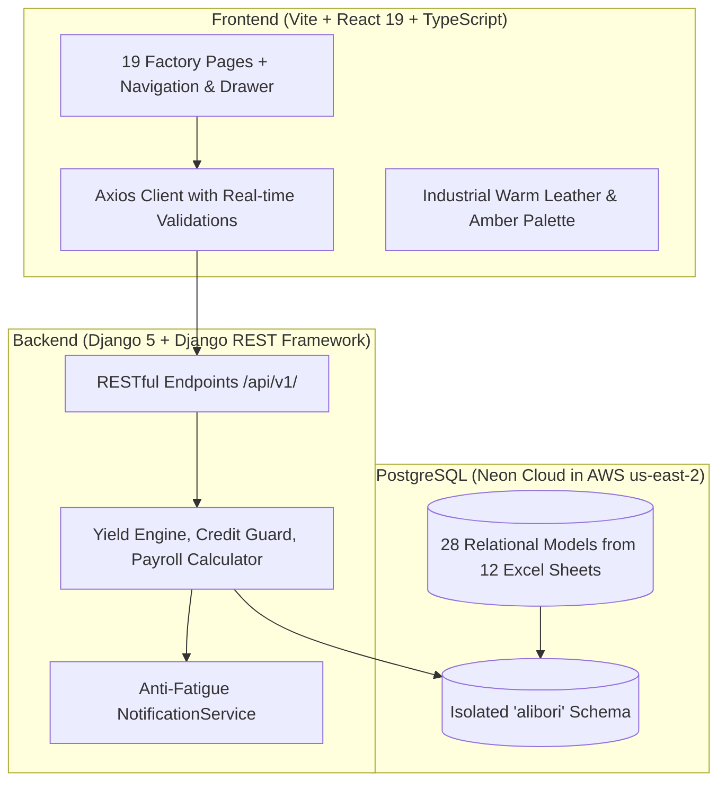

# Ali Bori Shoe Lace Factory ERP

> Production-grade, full-stack Enterprise Resource Planning (ERP) platform built for **Ali Bori Shoe Lace Factory**, modernizing and normalizing their 12-sheet operational Excel workbook (`ali bori NEW shoe lace.xlsx`) into a centralized PostgreSQL system on Neon Cloud, paired with an industrial warm leather & amber UI built in React 19, TypeScript, and Vite.

---

## Table of Contents

- [Overview & Architecture](#overview--architecture)
- [Key Features & Business Rules](#key-features--business-rules)
- [Tech Stack](#tech-stack)
- [Prerequisites](#prerequisites)
- [Repository Structure](#repository-structure)
- [Backend Setup (Django + PostgreSQL)](#backend-setup-django--postgresql)
- [Frontend Setup (React + Vite)](#frontend-setup-react--vite)
- [Importing Excel Operational Data](#importing-excel-operational-data)
- [Running Automated Tests](#running-automated-tests)
- [Core API Endpoints](#core-api-endpoints)
- [Environment Variables Guide](#environment-variables-guide)

---

## Overview & Architecture

Ali Bori Shoe Lace Factory manufactures industrial and consumer shoelaces. This ERP replaces manual Excel tracking across 12 operational sheets, enforcing strict relational integrity, automated inventory tracking, two-phase manufacturing yield calculations, finished bag barcode controls, customer credit checks, and attendance-based payroll.



---

## Key Features & Business Rules

1. **Two-Phase Manufacturing Yield & Waste Calculation**:
   - **Phase 1 (Braiding)**: Raw yarn input (KG) $\rightarrow$ Braided cord output (KG) + Phase 1 waste (KG). Tracks Building 1 room allocations.
   - **Phase 2 (Tipping & Cutting)**: Tipping input cord $\rightarrow$ Finished shoelace output (KG) + Phase 2 waste (KG).
   - Permanent snapshots:
     $$\text{Yield \%} = \frac{\text{Finished Output KG}}{\text{Raw Yarn Input KG}} \times 100$$
     $$\text{Waste \%} = \frac{\text{Phase 1 Waste} + \text{Phase 2 Waste}}{\text{Raw Yarn Input KG}} \times 100$$
2. **Finished Product Bags (25.00 – 40.00 KG)**:
   - Mandatory weight boundary enforced by database check constraints and model validation.
   - Automatic unique barcode generation: `ABSL-YYYY-XXXXXX` (e.g. `ABSL-2026-000005`).
   - **Single-Dispatch Lock**: Bags marked `DISPATCHED` cannot be reused in another delivery (prevents double-billing).
3. **Customer Credit Limit Protection**:
   - Deliveries blocked if $\text{Current Outstanding} + \text{New Order Credit} > \text{Credit Limit}$.
   - Automatic notifications trigger at $\ge 80\%$ credit utilization.
4. **Receivables & Payment Collection**:
   - Tracks credit aging with status transitions: `PENDING` $\rightarrow$ `PARTIAL` $\rightarrow$ `SETTLED`.
   - `POST /api/v1/sales/orders/{id}/collect-payment/` records cash/bank payments, creates audit logs, and updates balances in real time.
5. **Workforce Attendance & Configurable Payroll**:
   - `UNIQUE(employee, date)` constraint prevents duplicate daily check-ins.
   - Configurable absence deduction modes (`DAILY_RATE`, `PERCENTAGE_OF_SALARY`, `FIXED_AMOUNT`).
   - Overtime hourly multipliers and Saturday shift allowances.
   - Freezes calculation policy snapshot inside payslips for historical audit integrity.
6. **Excel Normalization Engine**:
   - Imports all 12 workbook sheets: `MACHINES`, `MACHINE PARTS`, `RAW MATERIALS`, `PRODUCTES`, `shop count`, `SPARES`, `LABORERS`, `UTILITIES`, `ADDITIONAL PAYMENTS`, `utilities payment`, `files&documents`, `attendance`.

---

## Tech Stack

- **Backend**: Python 3.11+, Django 5.1, Django REST Framework, `psycopg3`, `django-cors-headers`, `openpyxl`.
- **Database**: Cloud PostgreSQL on Neon (`alibori` isolated schema).
- **Frontend**: React 19, TypeScript, Vite 8, Tailwind CSS, Lucide-react, Canvas Confetti.
- **Dual Visual Themes (Dark & Light)**:
  - **Industrial Dark Theme**:
    - Primary Dark / Leather: `#140A05`
    - Deep Wood Cards: `#1E130D`
    - Accent Rust / Terracotta: `#8B461E`
    - Golden Braided Amber: `#C87A38`
    - Crisp Paper White: `#FAF8F5`
  - **Artisanal Light Theme**:
    - Warm Canvas / Parchment: `#F6F3ED`
    - Crisp Clean White Cards: `#FFFFFF`
    - Warm Parchment Borders: `#E4DBCB`
    - Leather Rust Accent: `#8B461E`
    - Rich Amber Accent: `#B6631F`
    - Deep Espresso Typography: `#18100A`
  - **Seamless Switching**: One-click toggle in top Navbar (`Sun`/`Moon`) and visual selector cards in `Factory Settings`. Stored in `localStorage`.

---

## Prerequisites

Before starting, ensure you have the following installed on your machine:

- **Python**: Version 3.11, 3.12, or 3.13 (`python --version`)
- **Node.js**: Version 18.x or 20.x or higher (`node --version`)
- **npm**: Version 9.x or higher (`npm --version`)
- **PostgreSQL**: Neon Cloud database account or local PostgreSQL instance (version 14+)

---

## Repository Structure

```text
Ali_bori_shoelace/
├── .gitignore                      # Root gitignore (Python, Node, Vite, envs)
├── README.md                       # Main project setup and documentation
├── test_mvp_e2e.py                 # Live 7-step end-to-end integration test script
├── ali bori NEW shoe lace.xlsx     # Current 12-sheet Excel operational source
├── backend/
│   ├── manage.py                   # Django management script
│   ├── requirements.txt            # Backend Python dependencies
│   ├── .env.example                # Template for environment configuration
│   ├── .env                        # Local environment variables (not committed)
│   ├── core/                       # Django project root (settings, urls, wsgi, tests)
│   └── apps/                       # Modular Django domain apps
│       ├── catalog/                # Products, colors, thicknesses, Excel importer
│       ├── assets/                 # Machines, machine types, spare parts, utilities
│       ├── inventory/              # Raw materials, locations, stock ledger
│       ├── production/             # Batches, Phase 1 braiding, Phase 2 tipping
│       ├── store/                  # Finished bags (25-40 KG), barcodes, movements
│       ├── sales/                  # Customers, credit checks, dispatch, receivables
│       ├── workforce/              # Employees, attendance, configurable payroll
│       ├── utilities/              # Grinders, drills, scales, maintenance
│       ├── documents/              # File and compliance document archive
│       ├── audit/                  # Audit trail and logging
│       └── notifications/          # Anti-fatigue alerts and notification center
└── frontend/
    ├── package.json                # Frontend dependencies and scripts
    ├── vite.config.ts              # Vite configuration
    ├── tailwind.config.js          # Industrial leather/amber color theme
    ├── src/
    │   ├── App.tsx                 # Root layout and routing
    │   ├── api/client.ts           # Axios client configured for /api/v1/
    │   ├── components/             # Reusable UI (Navbar, Sidebar, NotificationDrawer)
    │   └── pages/                  # 19 operational factory views
```

---

## Backend Setup (Django + PostgreSQL)

### 1. Navigate to Backend Directory
```bash
cd backend
```

### 2. Create and Activate Virtual Environment
**On Windows (PowerShell / Command Prompt):**
```bash
python -m venv venv
venv\Scripts\activate
```

**On macOS / Linux:**
```bash
python3 -m venv venv
source venv/bin/activate
```

### 3. Install Python Dependencies
```bash
pip install --upgrade pip
pip install -r requirements.txt
```

### 4. Configure Environment Variables
Copy `.env.example` to `.env`:
```bash
cp .env.example .env
```
Edit `.env` and provide your PostgreSQL connection string:
```env
DEBUG=True
SECRET_KEY=ali_bori_factory_erp_super_secret_key_2026_production_grade_mvp
DATABASE_URL=postgresql://neondb_owner:<password>@<neon_host>.aws.neon.tech/neondb?sslmode=require
CORS_ALLOWED_ORIGINS=http://localhost:5173,http://localhost:3000,http://127.0.0.1:5173
PORT=8000
```

### 5. Run Database Migrations
Create the `alibori` isolated schema and apply all 28 relational models:
```bash
python manage.py migrate
```

### 6. Start the Backend Development Server
```bash
python manage.py runserver 0.0.0.0:8000
```
The REST API is now live at: **[http://localhost:8000/api/v1/](http://localhost:8000/api/v1/)**

---

## Frontend Setup (React + Vite)

### 1. Navigate to Frontend Directory
Open a new terminal tab and enter the frontend folder:
```bash
cd frontend
```

### 2. Install Node Dependencies
```bash
npm install
```

### 3. Start Frontend Development Server
```bash
npm run dev
```
The application will launch on: **[http://localhost:5173/](http://localhost:5173/)**

### 4. Build for Production
To generate an optimized production bundle in `frontend/dist/`:
```bash
npm run build
```

---

## Importing Excel Operational Data

The repository includes the Excel workbook `ali bori NEW shoe lace.xlsx`. To populate or re-sync the PostgreSQL database with the complete dataset:

```bash
# Run from backend directory (with virtual environment active):
python manage.py import_factory_data "..\ali bori NEW shoe lace.xlsx"
```

This imports:
- **365 Machines** (Building 1 & Building 2 across 9 rooms)
- **9 Machine Types & 28 Spare Parts**
- **20 Product Variants** (Colors, Thicknesses, Lengths)
- **11 Raw Material Types** (ST V, ST N, Storage Racks A/B/C/D)
- **27 Factory Laborers** with baseline salaries and room allocations
- **3 Utility Equipments** (Grinder, Drill, Mizan scales)
- **Attendance Records, Documents, and Utility Bills**

---

## Running Automated Tests

### 1. Django Unit Test Suite
Verifies bag weight boundaries (25–40 KG), yield/waste calculations, duplicate attendance prevention, payroll deduction rules, and customer credit enforcement:
```bash
cd backend
python manage.py test core --keepdb
```
*Expected Output:* `Ran 6 tests ... OK. Preserving test database for alias 'default'...`

### 2. Live End-to-End Acceptance Test
Executes a full lifecycle test across the running backend and live database:
```bash
# Run from repository root:
python test_mvp_e2e.py
```
*Steps verified:*
1. Customer verification (`Merkato Central Habesha Laces`) & credit limit (150,000 ETB).
2. Production batch creation (100 KG yarn).
3. Phase 1 Braiding completion (96.50 KG cord).
4. Phase 2 Tipping completion (94.00% yield, 6.00% waste) & packing 30.00 KG bag (`ABSL-YYYY-XXXXXX`).
5. Credit dispatch order creation with single-dispatch lock.
6. Partial payment collection (transition to `PARTIAL`).
7. Attendance-based payroll calculation across all 27 active factory laborers.

---

## Core API Endpoints

All endpoints are prefixed with `/api/v1/`:

| Domain | Method | Endpoint | Description |
| :--- | :---: | :--- | :--- |
| **Catalog** | `GET` | `/catalog/products/` | Product lines and thicknesses |
| **Catalog** | `GET` | `/catalog/variants/` | Shoelace SKUs and colors |
| **Machines** | `GET` | `/machines/` | 365 machines with Building 1/2 filters |
| **Machines** | `POST` | `/machines/{id}/log_service/` | Record maintenance or repair |
| **Inventory** | `GET` | `/inventory/raw-materials/` | Raw yarn stock, ST V, ST N, locations |
| **Inventory** | `GET` | `/inventory/spares/` | Spare parts catalog and reorder alerts |
| **Production**| `POST` | `/production/batches/` | Create manufacturing batch |
| **Production**| `PATCH`| `/production/batches/{id}/` | Complete Phase 1 / Phase 2 yield & waste |
| **Store** | `POST` | `/store/bags/` | Pack finished bag (`25.00 <= kg <= 40.00`) |
| **Sales** | `POST` | `/sales/orders/` | Create dispatch (credit limit check) |
| **Sales** | `POST` | `/sales/orders/{id}/collect-payment/` | Collect partial/full payment |
| **Sales** | `GET` | `/sales/customers/` | Customer credit utilization and ledger |
| **Workforce** | `GET` | `/workforce/employees/` | 27 laborers directory |
| **Workforce** | `POST` | `/workforce/attendance/bulk_mark/` | Mark daily attendance |
| **Workforce** | `POST` | `/workforce/payroll-periods/{id}/calculate/`| Calculate payroll with deduction rules |
| **Alerts** | `GET` | `/notifications/` | Active factory alerts (low stock, credit) |

---

## Environment Variables Guide

| Variable | Default (Dev) | Description |
| :--- | :--- | :--- |
| `DEBUG` | `True` | Set to `False` in production |
| `SECRET_KEY` | *(Django secret)* | Cryptographic signing key |
| `DATABASE_URL` | `postgresql://...` | Full PostgreSQL connection URI |
| `CORS_ALLOWED_ORIGINS` | `http://localhost:5173,...` | Allowed frontend origins |
| `PORT` | `8000` | Backend listening port |
